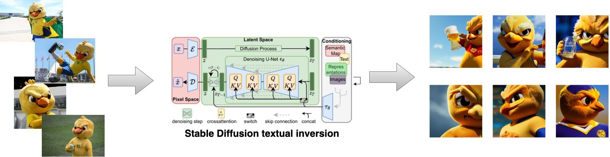

# StableDiffusion - Textual-Inversion


##### Stable Diffusion fine-tuned via textual inversion on images from "Canarinho pistola" Brazil's mascot during the 2006 World Cup.

---

This APP loads a pre-trained StableDiffusion model using the Keras framework and fine-tunes it using the [Textual Inversion](https://textual-inversion.github.io/) process, you will also find here how to serve StableDiffusion model's components using [TFServing](https://github.com/tensorflow/serving), and how to demo it using a [Gradio](https://gradio.app) app.

The model's weights are available at [HuggingFace Models](https://huggingface.co/Dimitre/stablediffusion-canarinho_pistola) and you can also try a running version at HuggingFace Spaces [](https://huggingface.co/spaces/Yuliang/ICON)

If you want you can also run this repository on Google Colab [](https://colab.research.google.com/drive/1-CsyQuqKWs1NWe55nepeUBzMK0PcRHpI?usp=sharing)

# Usage
This repository has a collection of Makefile commands that covers all the functionalities provided.

```bash
make train
```
Runs the textual inversion training script, you may want to customize the `params.yaml` file.

```bash
make app
```
Starts the Gradio app, this version of the Gradio app also loads the model for inference.

```bash
make app_serving
```
Starts the Gradio app, this version of the Gradio app used the TFServing endpoints for inference.

```bash
make serve
```
Starts the TFServing instance to serve the three models from StableDiffusion, you may want to customize the `serving_config.config` file.

```bash
make lint
```
Applies code linting and formatting.

```bash
make test
```
Runs unit tests.

```bash
make jupyter
```
Starts the JupyterLab instance.

```bash
make build
```
Builds the images for the the Gradio apps and the training feature.


# Acknowledgments
This code was heavily inspired by the [Teach StableDiffusion new concepts via Textual Inversion](https://keras.io/examples/generative/fine_tune_via_textual_inversion/) Keras code example from Luke Wood.


# Disclaimer regarding StableDiffusion
By using this model checkpoint, you acknowledge that its usage is subject to the terms of the CreativeML Open RAIL-M license at https://raw.githubusercontent.com/CompVis/stable-diffusion/main/LICENSE, more information about the model, its usage, and limitations at the [HuggingFace mode card](https://huggingface.co/CompVis/stable-diffusion-v1-4).


# References
- Keras.io blog [Teach StableDiffusion new concepts via Textual Inversion](https://keras.io/examples/generative/fine_tune_via_textual_inversion/)
- Various ways of serving Stable Diffusion [keras-sd-serving](https://github.com/deep-diver/keras-sd-serving), Courtesy of my colleagues Chansung and Sayak.
- Paper [An Image is Worth One Word: Personalizing Text-to-Image Generation using Textual Inversion](https://textual-inversion.github.io/)